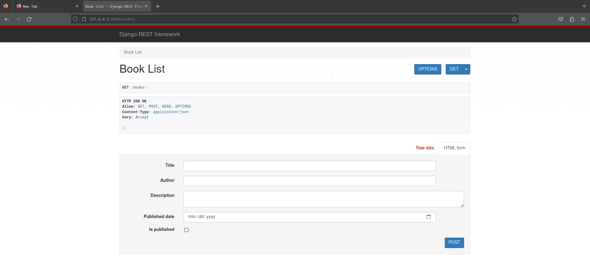
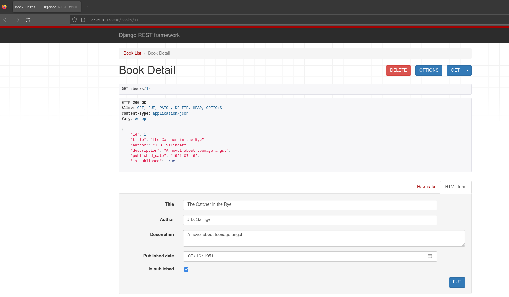

# **5.03 Create REST api**

## **Overview**
This submodule is designed to teach you how to create, RESTful APIs using Django REST Framework (DRF).
### **Objective**

By the end of this submodule, the learners should be able to:

- Create CRUD APIs for data models in Django,
- Authenticate DRF APIs,
- Validate and Sanitize data in REST APIs,
- Handle and create exceptions in DRF.
- TestingAPIs endpoints in DRF

**Keywords :**\
(**D**jango **R**est **F**ramework,  Serialization, Viewsets, Serializers, Authentication, Authorization, Permissions, Routing, API endpoints, JSON Web Tokens (JWT), Cross-Origin Resource Sharing (CORS), Pagination, Throttling, Testing, Swagger/OpenAPI documentation, Query parameters, Response formatting, Content negotiation, Request parsing, Response rendering)

**Resources :**

- [Django Rest Framework](https://www.django-rest-framework.org/)
- [Real Python](https://realpython.com/django-rest-framework-quick-start/)
- [Very Academy](https://www.youtube.com/watch?v=soxd_xdHR0o&list=PLOLrQ9Pn6caw0PjVwymNc64NkUNbZlhFw&ab_channel=VeryAcademy)

## **Setting the virtual environment and creating the project:**
1. Create a folder name **API_tutorial** \
```console 
$ mkdir API_tutorial && cd API_tutorial 
```

2. Create the virtual environment and activate it
```console
$ python3 -m venv venv 
$ source venv/bin/activate
```
3. install **Django** and **Django Rest Framework** using **pip**
```console 
$ pip install django 
$ pip install djangorestframework 
```
4. Create requirements file 
```console 
$ pip freeze > requirements.txt
```
5. Set up a new project with an application
```console
$ django-admin startproject myproject
$ cd myproject
$ django-admin startapp myBookapp
```

Your project layout should look like this 
```console 
├── API_tutorial            # Root directory for the project
    ├── venv                # Directory for the virtual environment
    ├── myproject/          # Directory for the Django project
    |    ├── myproject/     # Directory for the Django project settings
    |    │   ├── __init__.py  # Python module initialization file
    |    │   ├── settings.py  # Django project settings file
    |    │   ├── urls.py      # URL configuration for the project
    |    │   └── wsgi.py      # WSGI application entry point
    |    ├── myBookapp/     # Directory for the Django app
    |    │   ├── __init__.py  # Python module initialization file
    |    │   ├── admin.py     # Django admin configuration file
    |    │   ├── apps.py      # Django app configuration file
    |    │   ├── models.py    # Django app data models
    |    │   ├── tests.py     # Django app unit tests
    |    │   ├── urls.py      # URL configuration for the app
    |    │   └── views.py     # Django app views
    |    ├── manage.py       # Django project management script
    └── requirements.txt     # Python dependencies for the project

```
6. We'll need to add our new **myBookapp** app and the **rest_framework** app to INSTALLED_APPS. Let's edit the **myproject/settings.py** file:
```python
INSTALLED_APPS = [
    ...
    'rest_framework',
    'myBookapp',
]
```

7. Run the server
```console 
python manage.py runserver
```
## **Creating a CRUD app using DRF** 
In this example, **myBookapp/** is the directory containing the DRF CRUD application for books. Here is a brief explanation of the files and directories:
### **Creating the model to work with**

- In **myBookapp/models.py** create the book model, which defines the structure of the book table in the database. 
```python 
from django.db import models

class Book(models.Model):
    title = models.CharField(max_length=200)
    author = models.CharField(max_length=200)
    description = models.TextField()
    published_date = models.DateField()
    is_published = models.BooleanField(default=False)
```
To update the database schema in Django, you need to create new migration files using python manage.py makemigrations based on the changes made to your models, and then apply those changes to the database using python manage.py migrate.
``` console
$ python manage.py makemigrations
$ python manage.py migrate
```
### **Creating the serializers**
- DRF serializers convert Python objects into JSON, XML, or other content types for web transmission.
- Mapping fields define the serialization process, customizing data output.
- Validation rules format or structure data before serialization
- Model instances and non-model data can be serialized.
- Deserialization converts serialized data into a Python object.
- DRF serializers simplify handling of complex data structures and ensure correct formatting and validation for RESTful APIs in Django.

In **myBookapp** create new file called **serializers.py**. This file contains the serializer for the book model, which handles the conversion of Python objects to JSON and vice versa. Here is an example:

```python 
from rest_framework import serializers
from .models import Book

class BookSerializer(serializers.ModelSerializer):
    class Meta:
        model = Book
        fields = ['id','title','author','description','published_date','is_published']
```
### **Working with the views**
#### **Class-based views**
##### **Generics**
**books/views.py:** This file contains the views for the book API, including the CRUD operations for the book model. Here is an example:
```python 
from rest_framework import generics
from .models import Book
from .serializers import BookSerializer

class BookList(generics.ListCreateAPIView):
    queryset = Book.objects.all()
    serializer_class = BookSerializer

class BookDetail(generics.RetrieveUpdateDestroyAPIView):
    queryset = Book.objects.all()
    serializer_class = BookSerializer
```
The two classes BookList and BookDetail are Django REST Framework's generic views that are used to perform CRUD (Create, Retrieve, Update, Delete) operations on the Book model.

- BookList: This class is responsible for handling GET requests to retrieve a list of all the books and POST requests to create a new book. It inherits from the generics.ListCreateAPIView class, which provides default implementations for the get and post methods. The queryset attribute is used to specify the list of objects to be serialized, which in this case is all the objects in the Book model. The serializer_class attribute is used to specify the serializer to be used to serialize and deserialize the data.

- BookDetail: This class is responsible for handling GET, PUT, and DELETE requests on a single book object. It inherits from the generics.RetrieveUpdateDestroyAPIView class, which provides default implementations for the get, put, and delete methods. The queryset attribute is used to specify the list of objects to be serialized, which in this case is all the objects in the Book model. The serializer_class attribute is used to specify the serializer to be used to serialize and deserialize the data.
##### **Viewsets**

When you use ModelViewSet, Django REST Framework automatically generates the URLs for the CRUD (Create, Retrieve, Update, Delete) operations.\

```python 
from rest_framework import viewsets
from .models import Book
from .serializers import BookSerializer

class BookViewSet(viewsets.ModelViewSet):
    queryset = Book.objects.all()
    serializer_class = BookSerializer
```
##### **APIView**
We can achieve the same functionality using **APIView**\
**APIView** is a class provided by Django REST Framework that allows you to define custom views that handle HTTP requests and return HTTP responses.
```python
from rest_framework.views import APIView
from rest_framework.response import Response
from .models import Book
from .serializers import BookSerializer

class BookList(APIView):
    def get(self, request):
        books = Book.objects.all()
        serializer = BookSerializer(books, many=True)
        return Response(serializer.data)

    def post(self, request):
        serializer = BookSerializer(data=request.data)
        if serializer.is_valid():
            serializer.save()
            return Response(serializer.data, status=201)
        return Response(serializer.errors, status=400)

class BookDetail(APIView):
    def get_object(self, pk):
        try:
            return Book.objects.get(pk=pk)
        except Book.DoesNotExist:
            raise Http404

    def get(self, request, pk):
        book = self.get_object(pk)
        serializer = BookSerializer(book)
        return Response(serializer.data)

    def put(self, request, pk):
        book = self.get_object(pk)
        serializer = BookSerializer(book, data=request.data)
        if serializer.is_valid():
            serializer.save()
            return Response(serializer.data)
        return Response(serializer.errors, status=400)

    def delete(self, request, pk):
        book = self.get_object(pk)
        book.delete()
        return Response(status=204)
```
When using **APIView** we define the REST verbs using the functions **get, post, put** and **delete ** 
#### **Function based views**

We can also make the CRUD operation for the book using the following function based views
```python 
from rest_framework.decorators import api_view
from rest_framework.response import Response
from .models import Book
from .serializers import BookSerializer

@api_view(['GET', 'POST'])
def book_list(request):
    if request.method == 'GET':
        books = Book.objects.all()
        serializer = BookSerializer(books, many=True)
        return Response(serializer.data)

    elif request.method == 'POST':
        serializer = BookSerializer(data=request.data)
        if serializer.is_valid():
            serializer.save()
            return Response(serializer.data, status=201)
        return Response(serializer.errors, status=400)

@api_view(['GET', 'PUT', 'DELETE'])
def book_detail(request, pk):
    try:
        book = Book.objects.get(pk=pk)
    except Book.DoesNotExist:
        return Response(status=404)

    if request.method == 'GET':
        serializer = BookSerializer(book)
        return Response(serializer.data)

    elif request.method == 'PUT':
        serializer = BookSerializer(book, data=request.data)
        if serializer.is_valid():
            serializer.save()
            return Response(serializer.data)
        return Response(serializer.errors, status=400)

    elif request.method == 'DELETE':
        book.delete()
        return Response(status=204)
```
Here, we define two views: book_list for the list of books and book_detail for individual books. Both views are decorated with @api_view to indicate that they are API views that expect incoming requests to be in a particular format.
### **URL patterns**
In **myproject/urls.py** include all the urls that are created in **myBookapp**
```python 
from django.contrib import admin
from django.urls import path,include

urlpatterns = [
    path("admin/", admin.site.urls),
    path("",include('myBookapp.urls')),
]
```
**books/urls.py:** This file contains the URL patterns for the book views. Here is an example:

```python 
from django.urls import path
from .views import BookList, BookDetail

urlpatterns = [
    path('books/', BookList.as_view()),
    path('books/<int:pk>/', BookDetail.as_view()),
]
```


In this example, the **BookList** view handles the GET and POST requests for the book API, while the **BookDetail** view handles the **GET**, **PUT** and **DELETE** requests for a specific book.\
When we use **viewsets**  we include the URL patterns generated by the BookViewSet in your project's URL configuration. For example, you can access the List view of your **Book** model at **/books/** and the Detail view at **/books/<pk>/**.
```python
from django.urls import include, path
from rest_framework import routers
from .views import BookViewSet

router = routers.DefaultRouter()
router.register(r'books', BookViewSet)

urlpatterns = [
    path('', include(router.urls)),
]

```
A **DefaultRouter** is a router class provided by Django REST Framework that automatically generates the URL patterns for the views registered with it. It generates the following URL patterns for a viewset:

```python 
^<prefix>/$ (List view)
^<prefix>/(?P<pk>[^/.]+)/$ (Detail view)
```
## **Final view**

Finally your layout should like this 
```console 
├── API_tutorial/             # Root directory for the project
    ├── venv/                  # Directory for the virtual environment
    ├── myproject/             # Directory for the Django project
    |    ├── myproject/        # Directory for the Django project settings
    |    │   ├── __init__.py   # Python module initialization file
    |    │   ├── settings.py   # Django project settings file
    |    │   ├── urls.py       # URL configuration for the project
    |    │   ├── wsgi.py       # WSGI application entry point
    |    │   └── asgi.py       # ASGI application entry point
    |    ├── myBookapp/        # Directory for the Django app
    |    │   ├── __init__.py   # Python module initialization file
    |    │   ├── admin.py      # Django admin configuration file
    |    │   ├── apps.py       # Django app configuration file
    |    │   ├── models.py     # Django app data models
    |    │   ├── serializers.py # Django app serializer
    |    │   ├── tests.py      # Django app unit tests
    |    │   ├── urls.py       # URL configuration for the app
    |    │   └── views.py      # Django app views
    |    ├── db.sqllite3       # SQLite database file
    |    └── manage.py         # Django project management script
    └── requirements.txt       # Python dependencies for the project
```

Run the server using the command 
```console 
python manage.py runserver
```
For the url endpoint **'http://127.0.0.1:8000/books'** you can POST or GET the list of all books 

For the url endpoint **'http://127.0.0.1:8000/books/{id}/'** you can retreive, update or delete a book with specefic id 


Et Voila our first CRUD app in Django!