You will be installing Django within a virtual environment. Installing Django into an environment specific to your project will allow your projects and their requirements to be handled separately.

Once you have your database and application up and running, you will install and configure the Gunicorn application server. This will serve as an interface to our application, translating client requests from HTTP to Python calls that our application can process. You will then set up Nginx in front of Gunicorn to take advantage of its high performance connection handling mechanisms and its easy-to-implement security features.


1. Before logging in to EC2 copy project files

    ```shell
    scp -i <path/to/private/key> -r <path/to/project/folder> ubuntu@<EC2 IPv4 DNS address>:
    ```
2. Login to your EC@ instance using ssh:
    ```shell
    ssh -i <path/to/private/key> ubuntu@<EC2 IPv4 DNS address>
    ```
3. Update and install additional packages

    ```shell
    sudo apt update
    sudo apt install python3-venv python3-dev libpq-dev postgresql postgresql-contrib nginx curl
    ```
   
4. Create PostgreSQL database and user

    ```shell
    sudo -u postgres psql
    ```
    ```sql
    CREATE DATABASE mysite;
    CREATE USER mysiteuser WITH PASSWORD 'deploy1234';
    GRANT ALL PRIVILEGES ON DATABASE mysite TO mysiteuser;
    ```

5. Create and activate virtual environment in project folder

    ```shell
    cd mysite
    
    python3 -m venv mysitevenv
    
    source mysitevenv/bin/activate
    
    pip install django gunicorn psycopg2-binary
    ```
    > if you have a requirements.txt file you should also install at this point using `pip install -r requirements.txt`

6. Edit settings.py

    ```python
    ALLOWED_HOSTS = ["<EC2 public IPv4 address>", "localhost"]
    
    DATABASES = {
        "default": {
            "ENGINE": "django.db.backends.postgresql",
            "NAME": "mysite",
            "USER": "mysiteuser",
            "PASSWORD": "deploy1234",
            "HOST": "localhost",
            "PORT": 5432,
        }
    }
    
    ```

7. Complete initial setup

    ```shell
    python manage.py makemigrations
    python manage.py migrate
    
    python manage.py createsuperuser
    
    python manage.py collectstatic
    ```

8. Edit STATIC_ROOT in the settings.py file:

    ```shell
    sudo nano settings.py
    ```

    ```python
    STATIC_ROOT = "/var/www/html/"
    ```

9. Copy the static files from the project directory to a folder accessible by Gunicorn:

    ```shell
    # Create a static/ folder in the /var/www/html/ directory
    sudo mkdir static

    # Copy the folders from the mysite/staticfiles/ to /var/www/html/static/
    sudo cp mysite/staticfiles/admin /var/www/html/static/
    sudo cp mysite/staticfiles/css /var/www/html/static/
    sudo cp mysite/staticfiles/images /var/www/html/static/
    sudo cp mysite/staticfiles/js /var/www/html/static/
    ```

10. Allow traffic through port 8000

   * you should have a UFW firewall protecting your server. In order to test the development server, you need to allow access to the port you’ll be using.
   
    ```shell
    sudo ufw allow 8000
    ```

11. Test Django Development server

    ```shell
    python manage.py runserver 0.0.0.0:8000
    ``` 
    In your web browser, visit your server’s domain name or IP address followed by :8000:
    ```
    http://<server_domain_or_IP>:8000 
    ```
12. Testing Gunicorn’s Ability to Serve the Project

    * The last thing you need to do before leaving your virtual environment is test Gunicorn to make sure that it can serve the application. You can do this by entering the project directory and using gunicorn to load the project’s WSGI module:

    ```shell
    gunicorn --bind 0.0.0.0:8000 myproject.wsgi
    ```

    * This will start Gunicorn on the same interface that the Django development server was running on. You can go back and test the app again in your browser.
    
    > **Note:** The admin interface will not have any of the styling applied since Gunicorn does not know how to find the static CSS content responsible for this.    

13. Create Socket and Service files for Gunicorn
    
    Create the socket file:

    ```shell
    sudo nano /etc/systemd/system/gunicorn.socket
    ```
    
    Add the following code to the file and save it:
    
    ```
    [Unit]
    Description=gunicorn socket
    
    [Socket]
    ListenStream=/run/gunicorn.sock
    
    [Install]
    WantedBy=sockets.target
    ```

    Create the service file:
    
    ```shell
    sudo nano /etc/systemd/system/gunicorn.service
    ```
    
    Add the following code to the file and save it:

    ```shell
    [Unit]
    Description=gunicorn daemon
    Requires=gunicorn.socket
    After=network.target
    
    [Service]
    User=ubuntu
    Group=www-data
    WorkingDirectory=/home/ubuntu/mysite
    ExecStart=/home/ubuntu/mysite/mysitevenv/bin/gunicorn \
              --access-logfile - \
              --workers 3 \
              --bind unix:/run/gunicorn.sock \
              mysite.wsgi:application
    
    [Install]
    WantedBy=multi-user.target
    ```

14. Boot gunicorn socket

    ```shell
    sudo systemctl start gunicorn.socket
    sudo systemctl enable gunicorn.socket
    ```

15. Check for the Gunicorn socket file

    ```shell
    sudo systemctl status gunicorn.socket
    ```
    ```shell
    Output
    ● gunicorn.socket - gunicorn socket
         Loaded: loaded (/etc/systemd/system/gunicorn.socket; enabled; vendor preset: enabled)
         Active: active (listening) since Mon 2022-04-18 17:53:25 UTC; 5s ago
       Triggers: ● gunicorn.service
         Listen: /run/gunicorn.sock (Stream)
         CGroup: /system.slice/gunicorn.socket
    
    Apr 18 17:53:25 django systemd[1]: Listening on gunicorn socket.
    ```
    
    Next, check for the existence of the gunicorn.sock file within the /run directory:

    ```shell
    file /run/gunicorn.sock
    ```
    ```shell
    Output
    /run/gunicorn.sock: socket
    ```
    
    If the `systemctl status` command indicated that an error occurred or if you do not find the gunicorn.sock file in the directory, it’s an indication that the Gunicorn socket was not able to be created correctly. Check the Gunicorn socket’s logs by typing:
    ```shell
    sudo journalctl -u gunicorn.socket
    ```
    
    > Take another look at your `/etc/systemd/system/gunicorn.socket` file to fix any problems before continuing.

16. Testing Socket Activation

    Currently, if you’ve only started the gunicorn.socket unit, the gunicorn.service will not be active yet since the socket has not yet received any connections. You can check this by typing:
    ```shell
    sudo systemctl status gunicorn
    ```
    ```shell
    Output
    ○ gunicorn.service - gunicorn daemon
         Loaded: loaded (/etc/systemd/system/gunicorn.service; disabled; vendor preset: enabled)
         Active: inactive (dead)
    TriggeredBy: ● gunicorn.socket
    ```
    
    To test the socket activation mechanism, you can send a connection to the socket through `curl` by typing:
    ```shell
    curl --unix-socket /run/gunicorn.sock localhost
    ```
    
    You should receive the HTML output from your application in the terminal. This indicates that Gunicorn was started and was able to serve your Django application. You can verify that the Gunicorn service is running by typing:
    ```shell
    sudo systemctl status gunicorn
    ```
    ```shell
    Output
    ● gunicorn.service - gunicorn daemon
         Loaded: loaded (/etc/systemd/system/gunicorn.service; disabled; vendor preset: enabled)
         Active: active (running) since Mon 2022-04-18 17:54:49 UTC; 5s ago
    TriggeredBy: ● gunicorn.socket
       Main PID: 102674 (gunicorn)
          Tasks: 4 (limit: 4665)
         Memory: 94.2M
            CPU: 885ms
         CGroup: /system.slice/gunicorn.service
                 ├─102674 /home/sammy/myprojectdir/myprojectenv/bin/python3 /home/sammy/myprojectdir/myprojectenv/bin/gunicorn --access-logfile - --workers 3 --bind unix:/run/gunicorn.sock myproject.wsgi:application
                 ├─102675 /home/sammy/myprojectdir/myprojectenv/bin/python3 /home/sammy/myprojectdir/myprojectenv/bin/gunicorn --access-logfile - --workers 3 --bind unix:/run/gunicorn.sock myproject.wsgi:application
                 ├─102676 /home/sammy/myprojectdir/myprojectenv/bin/python3 /home/sammy/myprojectdir/myprojectenv/bin/gunicorn --access-logfile - --workers 3 --bind unix:/run/gunicorn.sock myproject.wsgi:application
                 └─102677 /home/sammy/myprojectdir/myprojectenv/bin/python3 /home/sammy/myprojectdir/myprojectenv/bin/gunicorn --access-logfile - --workers 3 --bind unix:/run/gunicorn.sock myproject.wsgi:application
    
    Apr 18 17:54:49 django systemd[1]: Started gunicorn daemon.
    Apr 18 17:54:49 django gunicorn[102674]: [2022-04-18 17:54:49 +0000] [102674] [INFO] Starting gunicorn 20.1.0
    Apr 18 17:54:49 django gunicorn[102674]: [2022-04-18 17:54:49 +0000] [102674] [INFO] Listening at: unix:/run/gunicorn.sock (102674)
    Apr 18 17:54:49 django gunicorn[102674]: [2022-04-18 17:54:49 +0000] [102674] [INFO] Using worker: sync
    Apr 18 17:54:49 django gunicorn[102675]: [2022-04-18 17:54:49 +0000] [102675] [INFO] Booting worker with pid: 102675
    Apr 18 17:54:49 django gunicorn[102676]: [2022-04-18 17:54:49 +0000] [102676] [INFO] Booting worker with pid: 102676
    Apr 18 17:54:50 django gunicorn[102677]: [2022-04-18 17:54:50 +0000] [102677] [INFO] Booting worker with pid: 102677
    Apr 18 17:54:50 django gunicorn[102675]:  - - [18/Apr/2022:17:54:50 +0000] "GET / HTTP/1.1" 200 10697 "-" "curl/7.81.0"
    ```
    
    If the output from `curl` or the output of `systemctl status` indicates that a problem occurred, check the logs for additional details:
    ```shell
    sudo journalctl -u gunicorn
    ```
    
    Check your `/etc/systemd/system/gunicorn.service` file for problems. If you make changes to the `/etc/systemd/system/gunicorn.service` file, reload the daemon to reread the service definition and restart the Gunicorn process by typing:
    ```shell
    sudo systemctl daemon-reload
    sudo systemctl restart gunicorn
    ```
    
    > **Make sure you troubleshoot the above issues before continuing.**

17. Configure Nginx to Proxy Pass to Gunicorn

    Now that Gunicorn is set up, you need to configure Nginx to pass traffic to the process.
    
    Start by creating and opening a new server block in Nginx’s sites-available directory:
    ```shell
    sudo nano /etc/nginx/sites-available/mysite
    ```
    ```
    server {
        listen 80;
        server_name 16.16.206.250;
    
        location /static/ {
            root /var/www/html/;
        }
    
        location / {
            include proxy_params;
            proxy_pass http://unix:/run/gunicorn.sock;
        }
    }
    ```
    
    Save and close the file when you are finished. Now, you can enable the file by linking it to the sites-enabled directory:
    ```shell
    sudo ln -s /etc/nginx/sites-available/mysite /etc/nginx/sites-enabled
    ```
    
    Test your Nginx configuration for syntax errors by typing:
    ```shell
    sudo nginx -t
    ```
    
    If no errors are reported, go ahead and restart Nginx by typing:
    ```shell
    sudo systemctl restart nginx
    ```
    
    Finally, you need to open up your firewall to normal traffic on port 80. Since you no longer need access to the development server, you can remove the rule to open port 8000 as well:
    ```shell
    sudo ufw delete allow 8000
    sudo ufw allow 'Nginx Full'
    ```

**You should now be able to go to your server’s domain or IP address to view your application.**

## Troubleshooting Nginx and Gunicorn
For additional troubleshooting, the logs can help narrow down root causes. Check each of them in turn and look for messages indicating problem areas.

The following logs may be helpful:

* Check the Nginx process logs by typing: `sudo journalctl -u nginx`
* Check the Nginx access logs by typing: `sudo less /var/log/nginx/access.log`
* Check the Nginx error logs by typing: `sudo less /var/log/nginx/error.log`
* Check the Gunicorn application logs by typing: `sudo journalctl -u gunicorn`
* Check the Gunicorn socket logs by typing: `sudo journalctl -u gunicorn.socket`

As you update your configuration or application, you will likely need to restart the processes to adjust to your changes.

If you update your Django application, you can restart the Gunicorn process to pick up the changes by typing:
```shell
sudo systemctl restart gunicorn
```

If you change Gunicorn socket or service files, reload the daemon and restart the process by typing:
```shell
sudo systemctl daemon-reload
sudo systemctl restart gunicorn.socket gunicorn.service
```

If you change the Nginx server block configuration, test the configuration and then Nginx by typing:
```shell
sudo nginx -t && sudo systemctl restart nginx
```

These commands are helpful for picking up changes as you adjust your configuration.

### Extra Resources
[Gunicorn and Nginx in a nutshell](https://vsupalov.com/gunicorn-and-nginx/)

[Securely Deploy a Django App with Gunicorn, Nginx & HTTPS](https://realpython.com/django-nginx-gunicorn/)

[Gunicorn](https://unogeeks.com/gunicorn/)

[What is Nginx? All you need to know](https://www.papertrail.com/solution/guides/nginx/#:~:text=NGINX%20processes%20highly%20efficient%20run,%2C%20binding%2C%20and%20crossing%20sockets.)

[What is Nginx?](https://www.javatpoint.com/nginx-introduction)


## Extending the deployment using S3 to store static files


Amazon's Simple Storage System (S3) provides a simple, cost-effective way to store static files. We will configure Django to load and serve up static files, public and private, via an Amazon S3 bucket.

Amazon provides a free tier with 5GB of S3 storage.

1. To create an S3 bucket, navigate to the [S3 page](https://console.aws.amazon.com/s3) and click "Create bucket":

    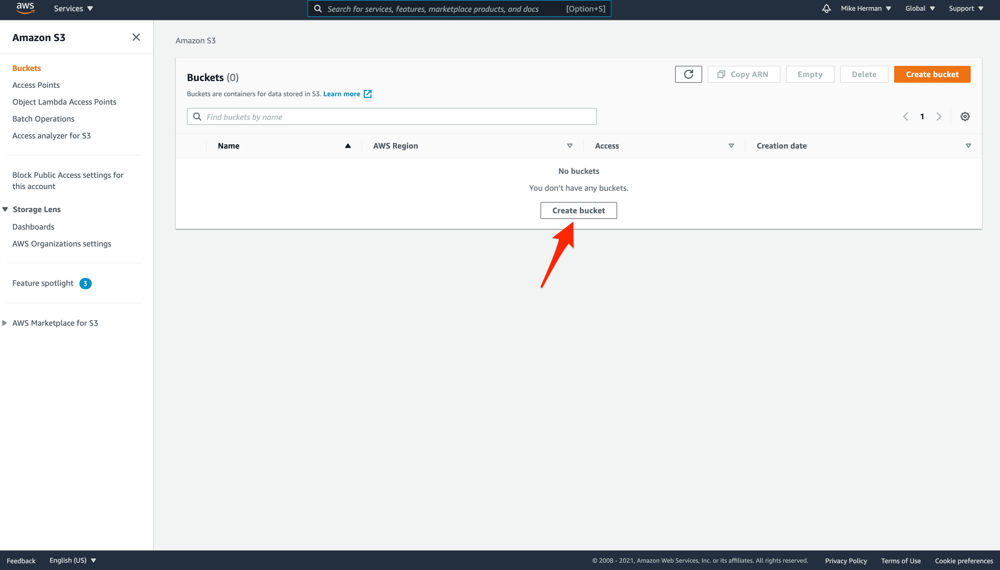

2. Give the bucket a unique, DNS-compliant name and leave "General Purpose" Selected:

    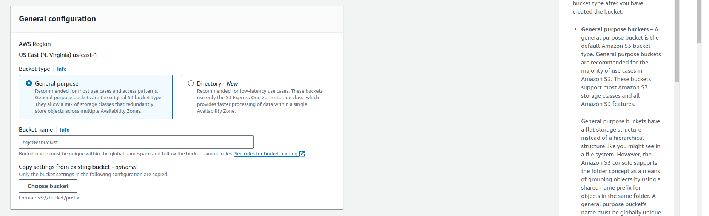

3. Under "Object Ownership", select "ACLs enabled". Turn off "Block all public access":

    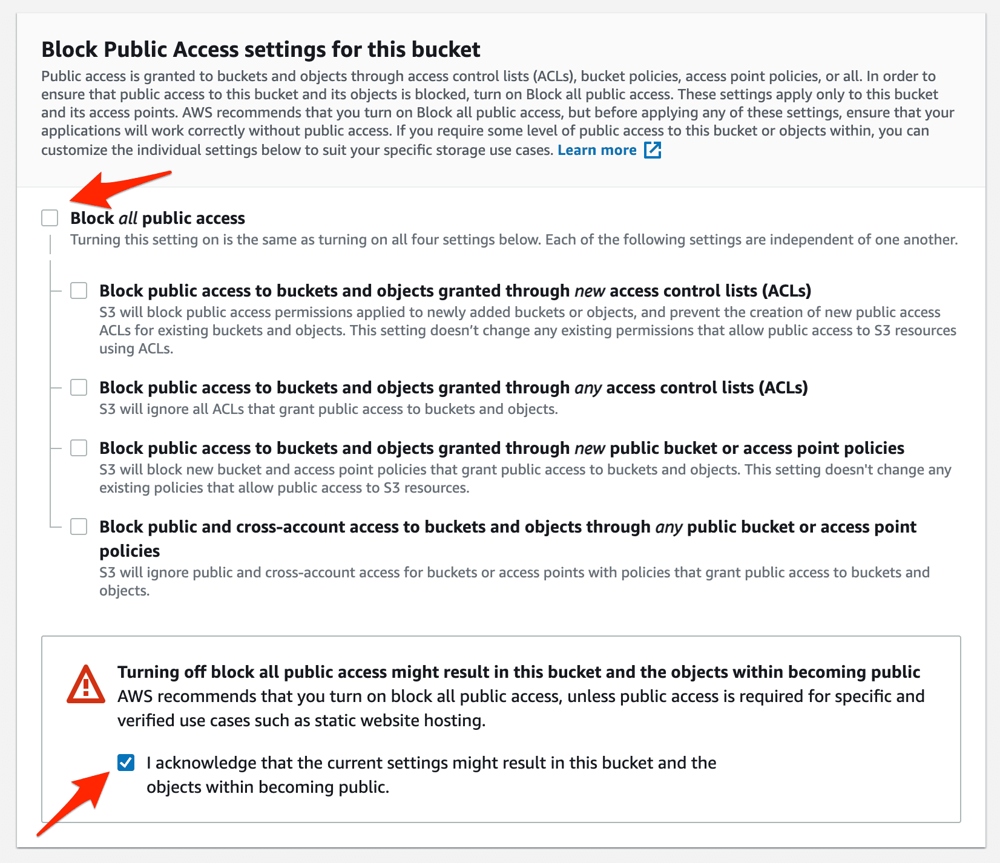

4. Create the bucket. You should now see your bucket back on the main S3 page:

    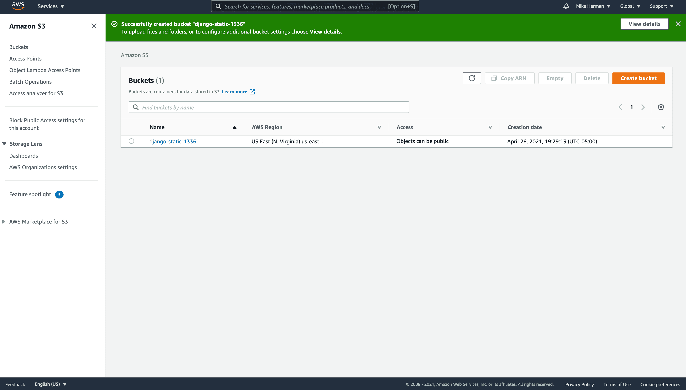

**IAM Access**

Although you could use the AWS root user, it's best for security to create an IAM user that only has access to S3 or to a specific S3 bucket. What's more, by setting up a group, it makes it much easier to assign (and remove) access to the bucket. So, we'll start by setting up a group with limited permissions and then create a user and assign that user to the group.

**IAM Group**

5. Within the AWS Console, navigate to the main IAM page and click "User groups" on the sidebar. Then, click the "Create group" button. Provide a name for the group and then search for and select the built-in policy "AmazonS3FullAccess":

    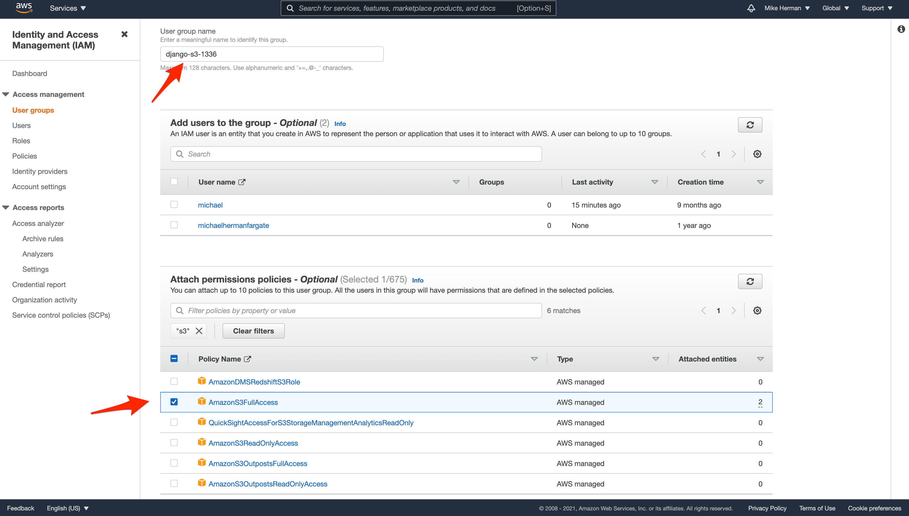

6. Click "Create Group" to finish setting up the group:

    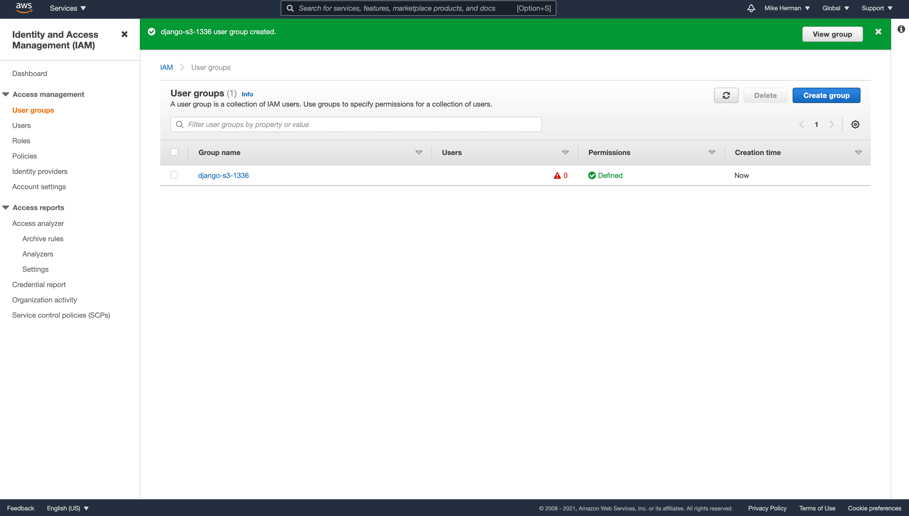

    > If you'd like to limit access even more, to the specific bucket we just created, create a new policy with the following permissions:
    ```json
    {
        "Version": "2012-10-17",
        "Statement": [
            {
                "Effect": "Allow",
                "Action": "s3:*",
                "Resource": [
                    "arn:aws:s3:::your-bucket-name",
                    "arn:aws:s3:::your-bucket-name/*"
                ]
            }
        ]
    }
    ```
    > Be sure to replace your-bucket-name with the actual name. Then, detach the "AmazonS3FullAccess" policy from the group and attach the new policy.

7. **IAM User**

    Back on the main IAM page, click "Users" and then "Create user". Define a user name and click the next button.

    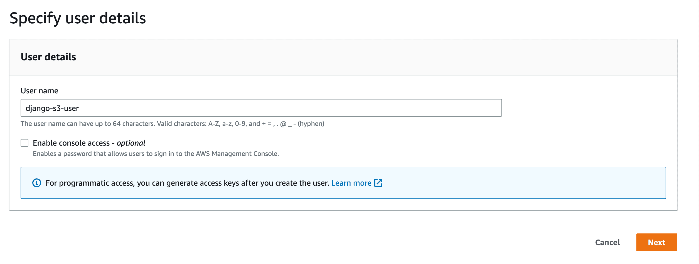

8. In the "Permissions" step, Select the group we just created the click next:

    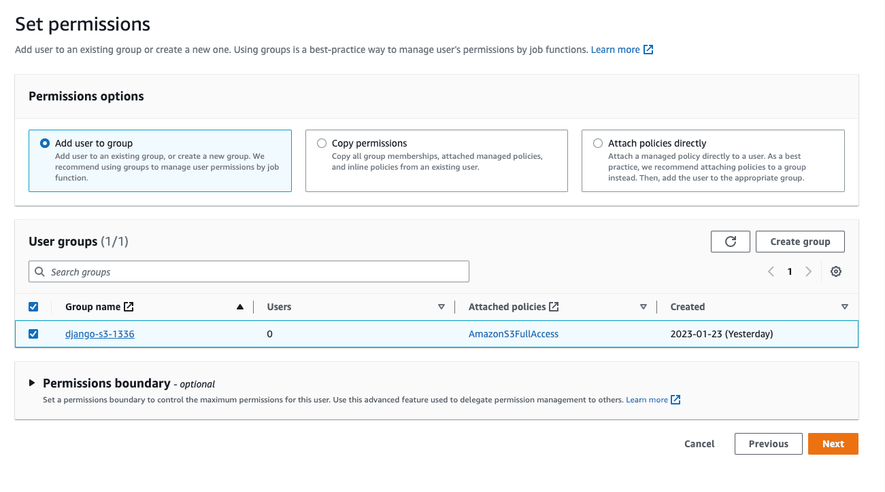

9. Click "Create user" to create the new user.

    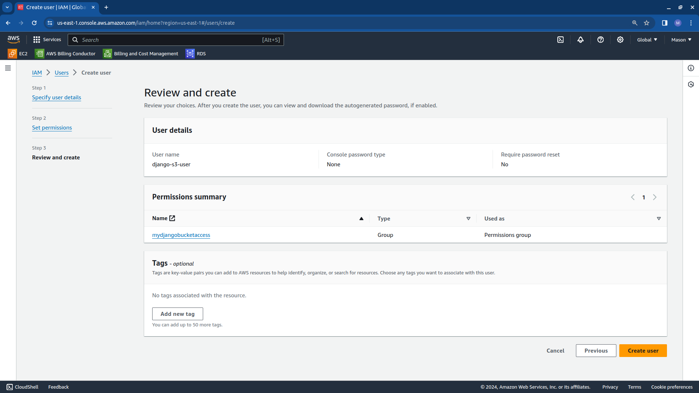

10. Now click on the user name to view the user details. Click on the "Security credentials" tab and then click "Create access key". Choose "Application running on an AWS compute service" and click the next button.

    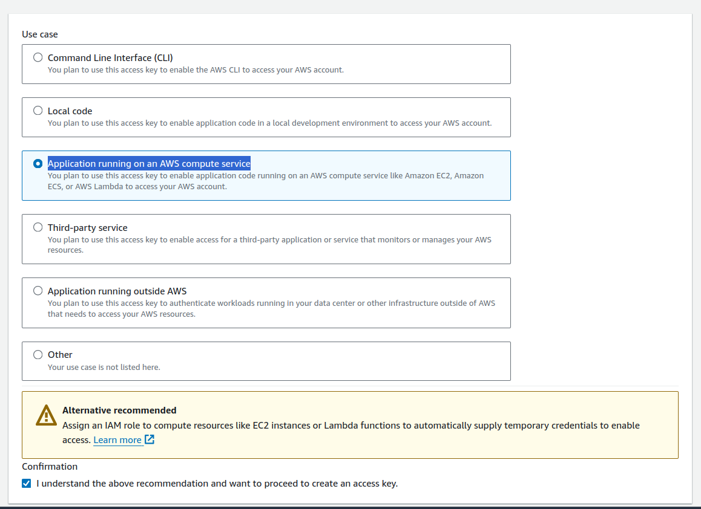

11. After that, click on "Create access key" button and take note of the keys.

    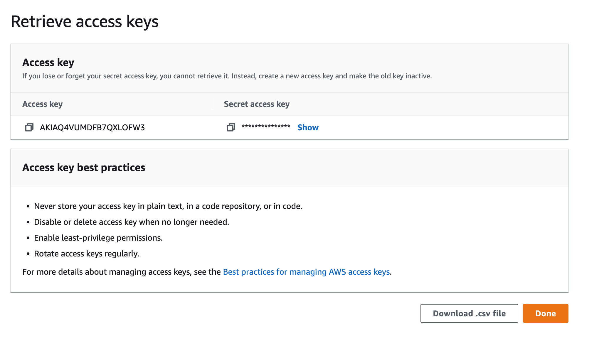

**Django Storages**

12. Next, connect to your AWS EC2 instance and navigate to your project directory. Activate your virtual environment. 

13. Using pip install `django-storages`, to use S3 as the main Django storage backend, and `boto3`, to interact with the AWS API.

    ```shell
    pip install boto3 django-storages
    ```

14. Add `storages` to the `INSTALLED_APPS` in settings.py.

**Static Files**

15. Moving along, we need to update the handling of static files in settings.py:

    ```python
    STATIC_URL = "static/"
    STATICFILES_DIRS = [BASE_DIR/'static/']
    STATIC_ROOT =  '/var/www/html/'
    ```
    Replace those settings with the following:

    ```python
    # aws settings
    AWS_ACCESS_KEY_ID = <yOUR KEY ID>
    AWS_SECRET_ACCESS_KEY = <YOUR ACCESS KEY>
    AWS_STORAGE_BUCKET_NAME = <YOUR BUCKET NAME>
    AWS_DEFAULT_ACL = 'public-read'
    AWS_S3_CUSTOM_DOMAIN = f'{AWS_STORAGE_BUCKET_NAME}.s3.amazonaws.com'
    AWS_S3_OBJECT_PARAMETERS = {'CacheControl': 'max-age=86400'}

    # s3 static settings
    AWS_LOCATION = 'static'
    STATIC_URL = f'https://{AWS_S3_CUSTOM_DOMAIN}/{AWS_LOCATION}/'
    STATICFILES_STORAGE = 'storages.backends.s3boto3.S3Boto3Storage'

    STATICFILES_DIRS = (os.path.join(BASE_DIR, 'static'),)
    ```

    > The `STATICFILES_STORAGE` setting configures Django to automatically add static files to the S3 bucket when the `collectstatic` command is run.

16. Collect the static files:

    ```shell
    python manage.py collectstatic
    ```

17. Edit the file `/etc/nginx/sites-available/mysite` to look like this:

    ```nginx
    server {
            listen 80;
            server_name 54.92.164.66;

            location /static/ {
                    proxy_pass <YOUR STATIC URL>;
            }

            location / {
                    include proxy_params;
                    proxy_pass http://unix:/run/gunicorn.sock;
            }
    }
    ```

18. Restart Nginx and Gunicorn

    ```shell
    sudo systemctl daemon-reload
    sudo systemctl restart gunicorn
    sudo systemctl restart nginx
    ```
