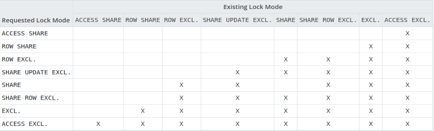

# Database Locking

```
LOCK TABLE <table_name>
IN <Lock Mode> [NOWAIT]
```

## Lock Modes



1. **Access Share**

    * It allows reading of data from the table but we cannot modify the table after acquiring the locks.
    * Used with the `SELECT` command.
    * Only conflicts with Access Exclusive.

    ```sql
    BEGIN;
    LOCK TABLE bank_accounts 
        IN ACCESS SHARE MODE;
    SELECT * FROM bank_accounts;
    ```

2. **Row Share**

    * Conflicts with Access Share, Exclusive and Access Exclusive.
    * The `SELECT` and `UPDATE` statements will acquire these locks.

    ```sql
    BEGIN;
    LOCK TABLE bank_accounts 
        IN ROW SHARE MODE;
    ```

3. **Row Exclusive**

    * Conflicts with Share Row Exclusive, Share, Access Exclusive and Exclusive.
    * Used with `UPDATE`, `DELETE` and `INSERT`. 

    ```sql
    BEGIN;
    LOCK TABLE bank_accounts 
        IN ROW EXCLUSIVE MODE;
    ```

4. **Share Update Exclusive**

    * Used with `VACUUM`, `CREATE INDEX`, `ALTER TABLE`, `VALIDATE`.
    * Conflicts with Share Row Exclusive, Share, Access Exclusive, and Exclusive.

    ```sql
    BEGIN;
    LOCK TABLE bank_accounts 
        IN SHARE UPDATE EXCLUSIVE MODE;
    ```

5. **Share**

    * Used with `CREATE INDEX`.
    * Conflicts with Share Row Exclusive, Share, Access Exclusive, Share Update Exclusive and Exclusive.

    ```sql
    BEGIN;
    LOCK TABLE bank_accounts 
        IN SHARE MODE;
    ```

6. **Share Row Exclusive**

    * Conflicts with Share Row Exclusive, Share, Access Exclusive, Share Update Exclusive, Share and Exclusive

    ```sql
    BEGIN;
    LOCK TABLE bank_accounts 
        IN SHARE ROW EXCLUSIVEMODE;
    ```

7. **Exclusive**

    * Used with `REFRESH` and `MATERIALIZED VIEW`.
    * Conflicts with Share Row Exclusive, Share, Access Exclusive, Share Update Exclusive, Share, and Exclusive.

    ```sql
    BEGIN;
    LOCK TABLE bank_accounts 
        IN EXCLUSIVE MODE;
    ```

8. **Access Exclusive**

    * While using this lock the user can only access the table which the lock is applied on.
    * Conflicts with Share Row Exclusive, Share, Access Exclusive, Share Update Exclusive and Exclusive.

    ```sql
    BEGIN;
    LOCK TABLE bank_accounts 
        IN ACCESS EXCLUSIVE MODE;
    ```

> **Note:** *PostgreSQL employs multi-version concurrency control (MVCC) to ensure that data is available and consistent in high-concurrency contexts when a query requires modifying or deleting data. Since each transaction uses its copy of the database, neither write nor read operations will obstruct the other.*


