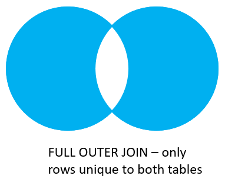

# Joins

- Implicit Joins
- Explicit joins:
    - Inner Join
    - Left Join
    - Left Outer Join
    - Right Join
    - Right Outer Join
    - Full Join
    - Full Outer Join 

## Implicit Join

- Its an indirect way to join two or more tables 

## Explicit Joins

- Directly/expressively defining joins on one or more database tables.

1. **Inner Join**:

    ```sql
    -- Inner Join
    SELECT fruit_a , fruit_b
    FROM basket_a
    INNER JOIN basket_b 
        ON fruit_a = fruit_b;
    ```

    

    Joins the first table `basket_a` with the second table `basket_b` by matching the values in the `fruit_a` and `fruit_b` columns.

2. **Left Join**:

    ```sql
    -- Left Join
    SELECT *
    FROM basket_b
    LEFT JOIN basket_a
        ON fruit_b = fruit_a;
    ```

    

    The left join selects data from the left table `basket_a`. It compares the values in the `fruit_a` column with values in the `fruit_b` column in `basket_b`. 
    If these values are equal, the left join creates a new row with columns from from both tables and adds it to the result.
    If the values do not equal, the left join creates a new row that contains columns from both tables and adds it to the result set. However, it fills the columns of the right table `basket_b` with `NULL`.

3. **Left Outer Join**:

    ```sql
    -- Left outer join (without OUTER clause)
    SELECT * 
    FROM basket_a
    LEFT JOIN basket_b
        ON fruit_a = fruit_b
    WHERE b_id IS NULL;

    -- OR

    -- Left outer join (with OUTER clause)
    SELECT *
    FROM basket_a -- left table
    LEFT OUTER JOIN basket_b -- right table
        ON fruit_a = fruit_b
    WHERE b_id IS NULL;
    ```

    

    To select rows from the left table that do not have matching rows in the right table, you use the left join with a `WHERE` clause.

    > **Note:** `LEFT JOIN` is the same as the `LEFT OUTER JOIN` so you can use them interchangeably.

4. **Right Join**:

    ```sql
    -- Right Join
    SELECT *
    FROM basket_a
    RIGHT JOIN basket_b
        ON fruit_a = fruit_b;
    ```

    

    - The right join is the reverse of the left join. The right join selects data starting with the right table `basket_b`. It compares each value in `fruit_b` column in the `basket_b` table with each value in the `fruit_a` column in the `basket_a` table.
    - If these values are equal, the right join creates a new row that contains columns from both tables.
    - If the values are not equal the right join creates a new row with columns from both tables. However it fills the columns in the left table with `NULL`.

5. **Right Outer Join**:

    ```sql
    -- Right outer join (without the OUTER clause)
    SELECT * 
    FROM basket_a
    RIGHT JOIN basket_b
        ON fruit_a = fruit_b
    WHERE a_id IS NULL;

    -- Right outer join (with the OUTER clause)
    SELECT *
    FROM basket_a
    RIGHT OUTER JOIN basket_b
        ON fruit_a = fruit_b
    WHERE a_id IS NULL;
    ```

    

    To select rows from the right table that do not have matching rows in the left table, you use the left join with the `WHERE` clause.

    > **Note:** `RIGHT JOIN` is the same as `RIGHT OUTER JOIN` so they can be used interchangeably.

6. **Full Join**:

    ```sql
    -- Full Join
    SELECT *
    FROM basket_a
    FULL OUTER JOIN basket_b
        ON fruit_a = fruit_b;
    ```

    

    - The full join returns a result set that contains all rows from both the left and right tables, with matching rows from both side if available. In case there is no match, the columns of the table will be filled with `NULL`.

7. **Full Outer Join**:

    ```sql
    -- Full Outer Join
    SELECT *
    FROM basket_a 
    FULL OUTER JOIN basket_b
        ON fruit_a = fruit_b
    WHERE a_id IS NULL OR b_id IS NULL;
    ```

    

    - To return rows in a table that do not have matching rows in the other, you use full join with a `WHERE` clause.
